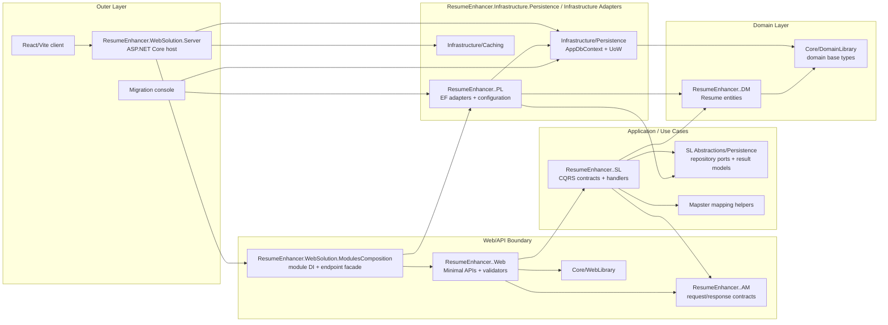

# ResumeEnhancer

ResumeEnhancer is a modular .NET solution for resume management. It combines a
layered modular-monolith architecture with CQRS-style application handlers,
Minimal APIs, shared EF Core persistence infrastructure, explicit migrations,
and a React/Vite client shell.

## Architecture Summary

The solution is organized by platform area first, then by business module:

- `Core` contains shared domain and common library projects.
- `Infrastructure` contains reusable technical capabilities such as caching,
  persistence, and migrations.
- `Modules` contains business modules. The current implemented module is
  `<ModuleName>`.
- `WebSolution` contains the ASP.NET Core host and React/Vite client.
- `test` contains unit tests, HTTP integration tests, and reusable integration
  test support utilities.

The Resume module is split into application model, domain model, service layer,
persistence layer, and web/API layer projects. The host composes shared
infrastructure and enters all modules through `WebSolution/ModulesComposition`;
that boundary registers module web layers and persistence adapters.

## Architecture Fit

These scores are a qualitative snapshot of the current structure, not a claim
that every pattern is implemented in its strictest form.

| Architecture or practice | Current fit | How the project fulfills it | Remaining gap or tradeoff |
| --- | --- | --- | --- |
| Layered Architecture | Strong, about 92% | The solution has clear Core, Infrastructure, Modules, and WebSolution areas. Resume module code is split into AM, DM, SL, PL, Web, and application composition responsibilities. | Some shared infrastructure is still registered directly by the host, which is normal for the current composition style. |
| Modular Architecture | Strong, about 92% | Resume functionality is isolated under `Modules/<ModuleName>`; host-facing registration starts through `WebSolution/ModulesComposition`, so the host does not reference module AM, SL, PL, DM, or Web projects directly. | Cross-module communication rules are not yet needed or formalized because there is only one business module. |
| Vertical Slice Architecture | Moderate to strong, about 72% | Resume command/query contracts, handlers, validators, and Minimal API endpoints are split per use case, with one endpoint operation per file. | The solution is still primarily layered by project. A stricter vertical-slice structure would group all files for a use case together across Web/SL/PL boundaries. |
| Clean Architecture | Strong, about 93% | Domain model projects are infrastructure-free, `ResumeEnhancer.<ModuleName>.SL` owns use cases and persistence ports, `ResumeEnhancer.<ModuleName>.PL` implements those ports, Web does not reference PL, module composition is isolated in an outer application-level project, integration tests exercise the public HTTP boundary, and architecture tests enforce module dependency rules automatically. | Future cross-module communication rules will need to be formalized when additional business modules are introduced. |
| Clean Code principles | Strong, about 91% | Responsibilities are grouped into small folders/files, sample host code has been removed, dependencies are registered explicitly, validation and mapping are centralized, README files document local rules, and the test suite now separates unit tests, integration tests, and reusable test support. | Broader module count will eventually require stronger conventions for cross-module contracts. |

## Current Dependency Rule

The dependency direction is the main architectural guardrail:

```text
ResumeEnhancer.WebSolution.Server
  -> Infrastructure/Caching
  -> Infrastructure/Persistence
  -> WebSolution/ModulesComposition

ResumeEnhancer.WebSolution.ModulesComposition
  -> ResumeEnhancer.<ModuleName>.Web
  -> ResumeEnhancer.<ModuleName>.PL

ResumeEnhancer.<ModuleName>.Web
  -> Core/WebLibrary
  -> ResumeEnhancer.<ModuleName>.AM
  -> ResumeEnhancer.<ModuleName>.SL

ResumeEnhancer.<ModuleName>.SL
  -> ResumeEnhancer.<ModuleName>.AM
  -> ResumeEnhancer.<ModuleName>.DM

ResumeEnhancer.<ModuleName>.PL
  -> ResumeEnhancer.<ModuleName>.SL (persistence abstractions)
  -> ResumeEnhancer.<ModuleName>.DM
  -> Infrastructure/Persistence

Infrastructure/Migration
  -> Infrastructure/Persistence
  -> Modules/<ModuleName>/ResumeEnhancer.<ModuleName>.PL

ResumeEnhancer.<ModuleName>.DM
  -> Core/DomainLibrary

Infrastructure/Persistence
  -> Core/DomainLibrary

ResumeEnhancer.Tests.Integration
  -> ResumeEnhancer.WebSolution.Server
  -> TestUtilities/IntegrationSupport
  -> ResumeEnhancer.<ModuleName>.AM/DM/PL support assertions

TestUtilities/IntegrationSupport
  -> Core/DomainLibrary
  -> Infrastructure/Caching
  -> Infrastructure/Persistence
```

The host should not reference Resume module AM, DM, SL, PL, or Web projects
directly; it should enter modules through `WebSolution/ModulesComposition`.
`WebSolution/ModulesComposition` owns module registration, so it may reference module Web
and PL projects. `ResumeEnhancer.<ModuleName>.Web` must not reference PL. `ResumeEnhancer.<ModuleName>.SL` must
not reference PL; it defines persistence ports under application abstractions,
and PL implements them. Domain entities stay in DM, use-case orchestration stays
in SL, EF/database work stays in PL and shared ResumeEnhancer.Infrastructure.Persistence, and HTTP concerns
stay in Web.

## Outer-To-Domain Dependency Flow

Solid arrows show current compile-time dependency flow from outer layers toward
domain types. Domain projects do not depend back on web, application,
persistence, caching, or migration projects.



## High-Level Graph

```mermaid
flowchart TB
    subgraph WebSolution["WebSolution"]
        Client["ResumeEnhancer.WebSolution.Client<br/>React + Vite"]
        Server["ResumeEnhancer.WebSolution.Server<br/>ASP.NET Core host"]
    end

    subgraph <ModuleName>["<ModuleName>"]
        Composition["ResumeEnhancer.WebSolution.ModulesComposition<br/>module facade"]
        Web["ResumeEnhancer.<ModuleName>.Web<br/>Minimal APIs + validation"]
        AM["ResumeEnhancer.<ModuleName>.AM<br/>Requests + responses"]
        SL["ResumeEnhancer.<ModuleName>.SL<br/>CQRS handlers + mapping"]
        Ports["SL Persistence Ports<br/>IResumeRepository + criteria/results"]
        PL["ResumeEnhancer.<ModuleName>.PL<br/>EF adapters + configuration"]
        DM["ResumeEnhancer.<ModuleName>.DM<br/>Domain entities"]
    end

    subgraph Infrastructure["Infrastructure"]
        ResumeEnhancer.Infrastructure.Caching["ResumeEnhancer.Infrastructure.Caching<br/>ICacheProvider + strategies"]
        ResumeEnhancer.Infrastructure.Persistence["ResumeEnhancer.Infrastructure.Persistence<br/>AppDbContext + UoW"]
        Migration["Migration<br/>EF migration console"]
    end

    subgraph Core["Core"]
        ResumeEnhancer.Core.DomainLibrary["ResumeEnhancer.Core.DomainLibrary<br/>Audit/domain bases"]
        ResumeEnhancer.Core.CommonLibrary["ResumeEnhancer.Core.CommonLibrary"]
        ResumeEnhancer.Core.WebLibrary["ResumeEnhancer.Core.WebLibrary<br/>ASP.NET helpers"]
    end

    Database["SQL Server"]

    Client --> Server
    Server --> Composition
    Server --> ResumeEnhancer.Infrastructure.Caching
    Server --> ResumeEnhancer.Infrastructure.Persistence

    Composition --> Web
    Composition --> PL

    Web --> ResumeEnhancer.Core.WebLibrary
    Web --> AM
    Web --> SL

    SL --> AM
    SL --> Ports
    SL --> DM

    PL --> Ports
    PL --> DM
    PL --> ResumeEnhancer.Infrastructure.Persistence

    DM --> ResumeEnhancer.Core.DomainLibrary
    ResumeEnhancer.Infrastructure.Persistence --> ResumeEnhancer.Core.DomainLibrary
    ResumeEnhancer.Infrastructure.Persistence --> Database
    Migration --> ResumeEnhancer.Infrastructure.Persistence
    Migration --> PL
```

## Solution Layout

| Path | Purpose |
| --- | --- |
| `application/Core/DomainLibrary` | Shared domain base classes such as `AuditEntity`, `SetupEntity`, `BusinessEntity`, and relation bases. |
| `application/Core/CommonLibrary` | Reserved for framework-neutral shared utilities. It currently has no active shared helpers. |
| `application/Core/WebLibrary` | ASP.NET Core-specific endpoint execution and request/header helpers. |
| `application/Infrastructure/Caching` | Provider-neutral `ICacheProvider` with in-memory, Redis/distributed cache, and MemCache strategies. |
| `application/Infrastructure/Persistence` | Shared `AppDbContext`, unit of work, repositories, model loading, query specifications, transaction wrappers, and setup seeding helpers. |
| `application/Infrastructure/Migration` | Console project for creating EF migrations, applying migrations, and running seeders. |
| `application/Modules/<ModuleName>/<ModuleName>AM` | Project `ResumeEnhancer.<ModuleName>.AM`; owns request and response contracts shared by Web and SL. |
| `application/Modules/<ModuleName>/<ModuleName>DM` | Project `ResumeEnhancer.<ModuleName>.DM`; owns domain entities and setup/business relation models. |
| `application/Modules/<ModuleName>/<ModuleName>SL` | Project `ResumeEnhancer.<ModuleName>.SL`; owns CQRS contracts, Mediator handlers, persistence abstractions, and Mapster mapping helpers. |
| `application/Modules/<ModuleName>/<ModuleName>PL` | Project `ResumeEnhancer.<ModuleName>.PL`; owns EF configurations, module schema, implementations of SL-owned persistence ports, and seed data. |
| `application/Modules/<ModuleName>/<ModuleName>Web` | Project `ResumeEnhancer.<ModuleName>.Web`; owns Minimal API endpoints and FluentValidation validators. |
| `application/WebSolution/ModulesComposition` | Application-level module composition boundary; registers module Web/PL projects and exposes endpoint mapping. |
| `application/WebSolution/WebSolution.Server` | ASP.NET Core host, OpenAPI/Scalar setup, SPA hosting, and dependency composition. |
| `application/WebSolution/websolution.client` | React + TypeScript + Vite client shell. |
| `test/ResumeEnhancer.Tests` | Unit and focused component tests for core, infrastructure, composition, and Resume module behavior. |
| `test/IntegrationTest` | HTTP/API-boundary integration tests that host the real ASP.NET Core application with fake auth and in-memory relational persistence. |
| `test/TestUtilities/IntegrationSupport` | Reusable integration-test host, fake authentication, database, setupper, data-generation, and xUnit support utilities. |

## Responsibility-Based Folder Layout

`Infrastructure/Persistence` is grouped by persistence responsibility:

```text
Audit/
Composition/
Context/
Loading/
Querying/
Repositories/
Seeding/
Transactions/
UnitOfWork/
```

`ResumeEnhancer.<ModuleName>.SL` is grouped by CQRS/service-layer responsibility:

```text
Composition/
Abstractions/Persistence/
Contracts/Commands/
Contracts/Queries/
Handlers/Commands/
Handlers/Queries/
Mapping/
```

`ResumeEnhancer.<ModuleName>.PL` is grouped by persistence responsibility:

```text
Composition/
Configurations/
Context/
Repositories/
Seeding/
```

`ResumeEnhancer.WebSolution.ModulesComposition` is grouped as a small host-facing facade:

```text
DependencyInjection.cs
```

`ResumeEnhancer.<ModuleName>.Web` separates route registration, command endpoints, query
endpoints, and request validators:

```text
MiniApis/Commands/
MiniApis/Queries/
Validation/PersonalInformation/
Validation/Resumes/
Validation/Sections/
Validation/Shared/
```

## Patterns In Use

| Pattern | Where | Notes |
| --- | --- | --- |
| Modular monolith | Whole solution | One deployable host with isolated business modules. |
| Module composition boundary | `WebSolution/ModulesComposition` | Host references one module composition project; it composes Resume and future module Web/PL projects. |
| Layered module architecture | Resume module AM/DM/SL/PL/Web projects | Keeps transport, contracts, use cases, domain, and persistence separate. |
| CQRS-style handlers | `ResumeEnhancer.<ModuleName>.SL/Contracts` and `ResumeEnhancer.<ModuleName>.SL/Handlers` | Commands and queries are separate contracts handled through Mediator. |
| Mediator pattern | `ResumeEnhancer.<ModuleName>.Web` + `ResumeEnhancer.<ModuleName>.SL` | Minimal APIs send commands/queries to SL handlers via the martinothamar `Mediator` package. |
| Repository pattern | `ResumeEnhancer.<ModuleName>.SL/Abstractions/Persistence`, `ResumeEnhancer.<ModuleName>.PL/Repositories`, and `Infrastructure/Persistence/Repositories` | SL defines Resume-specific persistence ports, PL implements them, and shared ResumeEnhancer.Infrastructure.Persistence exposes common audited-entity repositories. |
| Unit of Work | `Infrastructure/Persistence/UnitOfWork` | One scoped `AppDbContext` and one scoped `UnitOfWork<AppDbContext>` per DI scope. |
| Query Specification | `Infrastructure/Persistence/Querying` | Reusable criteria/include/order/projection query shapes for audited entities. |
| Model Loader | `Infrastructure/Persistence/Loading` | Typed nested include-path builder for repository queries. |
| FluentValidation | `ResumeEnhancer.<ModuleName>.Web/Validation` | Request validation is a web-layer concern. SL handlers assume valid request contracts. |
| Mapster mapping | `ResumeEnhancer.<ModuleName>.SL/Mapping` | Maps AM contracts, DM entities, and persistence result models. |
| Strategy pattern | `Infrastructure/Caching/Strategies` | Cache provider behavior is selected by configuration. |
| Code-first migrations | `Infrastructure/Migration` | EF Core migrations live outside normal web startup. |
| Integration test host builder | `test/TestUtilities/IntegrationSupport/Hosting` | Standardizes `WebApplicationFactory`, fake auth, SQLite in-memory persistence, and selected DI overrides for real HTTP tests. |
| Setup object pattern | `test/IntegrationTest/Modules/<ModuleName>/*.Setup.cs` | Keeps `[Theory]` data compact with description, arrange delegate, input DTO, and assert delegate. |
| Architecture dependency tests | `test/ResumeEnhancer.Tests/Architecture` | Enforces module layer project-reference, package-reference, and current assembly dependency rules, including future module projects discovered under `application/Modules`. |

Auto-registration attributes, when introduced, should be used only in PL
implementation projects. Web and SL registrations should stay explicit.

## Resume API Surface

Resume Minimal APIs are grouped under:

```text
/api/resumes
```

Current endpoints:

| Method | Route | Use case |
| --- | --- | --- |
| `POST` | `/api/resumes/` | Create a resume. |
| `PUT` | `/api/resumes/{resumeId}` | Update a resume. |
| `DELETE` | `/api/resumes/{resumeId}` | Delete one resume. |
| `POST` | `/api/resumes/delete` | Delete multiple resumes. |
| `GET` | `/api/resumes/{resumeId}` | Get resume detail. |
| `POST` | `/api/resumes/search` | Search resumes with paging and filters. |
| `GET` | `/api/resumes/{resumeId}/exists` | Check resume existence. |

Endpoint handlers live one operation per file under
`ResumeEnhancer.<ModuleName>.Web/MiniApis/Commands` and `ResumeEnhancer.<ModuleName>.Web/MiniApis/Queries`.

## Persistence Model

`Infrastructure/Persistence` provides a shared `AppDbContext` and persistence
toolkit:

- audit-aware `SaveChangesAsync(IAudit)`
- optimistic concurrency retry for rowversion-backed `AuditEntity.App_Version`
- common `IAuditEntityRepository<T>` operations
- paged query results
- query specifications
- typed nested model loaders
- relational, nested, and non-relational transaction wrappers
- setup-data seeding helpers
- module table/schema mapping conventions

`UnitOfWork<AppDbContext>` is scoped with the `AppDbContext` and coordinates
repositories, save operations, setup entity preloading, and transaction entry.
It is infrastructure only; business rules belong in module handlers/services.

## Domain Table Categories

Shared domain base types in `ResumeEnhancer.Core.DomainLibrary.DomainModel` drive table categories:

| Base type | Table prefix | Use |
| --- | --- | --- |
| `SetupEntity` | `S_` | Seedable setup/master data. |
| `SetupRelation` | `SR_` | Seedable setup/config relationships. |
| `BusinessEntity` | `B_` | Operational root business records. |
| `BusinessRelation` | `BR_` | Operational child/relationship records. |

The Resume module schema is `resume`, so examples include
`resume.B_Resume`, `resume.BR_Education`, and
`resume.S_ResumeSectionSetup`.

## Validation And Mapping Rules

- Web request validation belongs in `ResumeEnhancer.<ModuleName>.Web`.
- FluentValidation validators live beside the web endpoints by request area.
- Simple and cross-field request rules should be expressed in validators.
- SL handlers should not duplicate request validation.
- Mapping belongs in `ResumeEnhancer.<ModuleName>.SL/Mapping` and uses Mapster.
- Custom mapping code should stay focused on workflow concerns such as access
  checks, normalization, and EF collection synchronization.

## Migration Workflow

Migrations are handled by the console project, not by normal web startup.

Show migration help:

```powershell
dotnet run --project application\Infrastructure\Migration\ResumeEnhancer.Infrastructure.Migration.csproj -- --help
```

Create a migration:

```powershell
dotnet run --project application\Infrastructure\Migration\ResumeEnhancer.Infrastructure.Migration.csproj -- -c AddResumeFields
```

Apply pending migrations:

```powershell
dotnet run --project application\Infrastructure\Migration\ResumeEnhancer.Infrastructure.Migration.csproj -- -a
```

Run seeders:

```powershell
dotnet run --project application\Infrastructure\Migration\ResumeEnhancer.Infrastructure.Migration.csproj -- -s
```

Create, apply, and seed:

```powershell
dotnet run --project application\Infrastructure\Migration\ResumeEnhancer.Infrastructure.Migration.csproj -- -c AddResumeFields -a -s
```

The migration console is verbose by default. It prints EF CLI details, pending
migrations, registered seeders, EF diagnostics, colored severity messages, and
full exception stack traces on failure.

Default development connection string:

```text
Data Source=localhost;Integrated Security=True;Persist Security Info=False;Server=TLG-PF5R29H7;Encrypt=True;TrustServerCertificate=True;Initial Catalog=ResumeEnhancer
```

## Main Dependencies

| Area | Dependencies |
| --- | --- |
| Runtime | .NET `net10.0` projects with nullable reference types enabled. |
| Web/API | ASP.NET Core, `Microsoft.AspNetCore.OpenApi`, `Scalar.AspNetCore`. |
| ResumeEnhancer.Infrastructure.Persistence | EF Core `Microsoft.EntityFrameworkCore`, `Relational`, `SqlServer`, and `Design` for migrations. |
| CQRS/Mediator | `Mediator.Abstractions` and `Mediator.SourceGenerator`. |
| Mapping | `Mapster`. |
| Validation | `FluentValidation` and `FluentValidation.DependencyInjectionExtensions`. |
| ResumeEnhancer.Infrastructure.Caching | `Microsoft.Extensions.Caching.*`, including in-memory and StackExchangeRedis support. |
| Client | React + TypeScript + Vite through the `.esproj` client project. |
| Testing | xUnit.net v3, Shouldly, NSubstitute, Moq, AutoFixture, Bogus, MoreLINQ, NetArchTest, ASP.NET Core MVC Testing, and EF Core SQLite. |

## Build

Build the full solution:

```powershell
dotnet build application\ResumeEnhancerApp.slnx
```

Run unit tests:

```powershell
dotnet test test\ResumeEnhancer.Tests\ResumeEnhancer.Tests.Unit.csproj --no-restore
```

Run integration tests:

```powershell
dotnet test test\IntegrationTest\ResumeEnhancer.Tests.Integration.csproj --no-restore
```

Current test count:

```text
Unit tests: 231 passing
Integration tests: 14 passing
Total tests: 245 passing
```

Run the API host:

```powershell
dotnet run --project application\WebSolution\WebSolution.Server\ResumeEnhancer.WebSolution.Server.csproj
```

In development, the host maps OpenAPI and Scalar API reference UI through
`MapOpenApi()` and `MapScalarApiReference()`.

## Adding A New Module

Use the Resume module as the template:

1. Create `ResumeEnhancer.<ModuleName>.DM` for domain entities.
2. Create `ResumeEnhancer.<ModuleName>.AM` for request and response contracts.
3. Create `ResumeEnhancer.<ModuleName>.SL` for CQRS contracts, handlers, mapping, and persistence ports.
4. Create `ResumeEnhancer.<ModuleName>.PL` for EF configuration, schema, seeders, and implementations of SL-owned ports.
5. Create `ResumeEnhancer.<ModuleName>.Web` for Minimal APIs, controllers, validators, and module web registration.
6. Add the module to `WebSolution/ModulesComposition` for host-facing registration and endpoint mapping.
7. Register persistence with `Add<ModuleName>ModulePersistence()` inside `ResumeEnhancer.WebSolution.ModulesComposition`.
8. Register web/application dependencies with `Add<ModuleName>ModuleWeb()` inside `ResumeEnhancer.WebSolution.ModulesComposition`.
9. Expose module registration through `AddApplicationModules()`.
10. Reference the module PL project from `Infrastructure/Migration`.
11. Reference only `WebSolution/ModulesComposition` from the host.
12. Create and review an EF migration.

## Current Notes

- Resume CRUD/search/exists API flows are implemented through Minimal APIs,
  Mediator handlers, Mapster mapping, SL-owned repository ports, and PL
  repository adapters.
- Resume API integration coverage exercises the real HTTP boundary, including
  routing, JSON binding, validation, mediator handlers, repository persistence,
  fake authentication headers, and database side effects.
- Architecture dependency tests enforce the clean dependency rule for current
  Resume module assemblies and automatically scan future module project files
  added under `application/Modules`.
- `Core/CommonLibrary` is intentionally light and currently has no active
  shared helpers.


