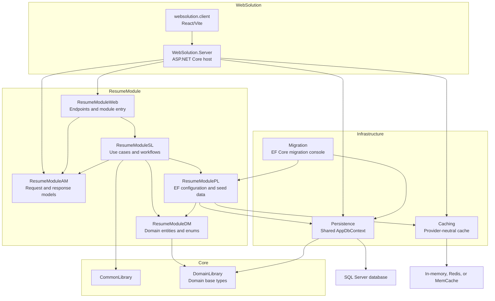
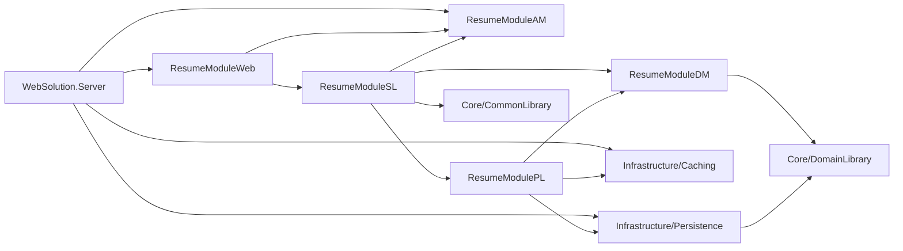

# ResumeEnhancer

ResumeEnhancer is a modular .NET solution for building resume-related domain,
persistence, migration, caching, API, and web-client components.

## Architecture Summary

The project currently follows a pragmatic modular monolith style with layered
module projects and clean dependency boundaries. The host starts module
registration through each module's Web project, while lower-layer dependencies
flow through the module layers. The host does not need direct references to
module domain, service, or persistence projects.

| Architecture | Current status | How this project applies it |
| --- | --- | --- |
| Clean Architecture | Partially implemented and actively aligned | Shared domain types live in `Core/DomainLibrary` and do not reference EF Core, ASP.NET Core, caching, or module persistence. Infrastructure projects depend inward on core/domain code. The host wires shared infrastructure and calls module Web registration, while domain and persistence stay behind the service layer. |
| Clean Code principles | Followed as coding guidance, not a separate architecture | Projects have focused responsibilities, explicit names, nullable reference types enabled, dependency injection extension methods, provider abstractions such as `ICacheProvider`, and module-specific documentation. |
| Vertical Slice Architecture | Structural foundation exists | Business capability is grouped under `Modules/ResumeModule`. The module reserves separate web, application-model, service, domain, and persistence projects so each resume use case can own its endpoint, request/response model, service workflow, validation, and persistence behavior within the module boundary. Full feature folders/handlers are not implemented yet. |
| Modular Architecture | Implemented | Resume functionality is isolated in `Modules/ResumeModule`, split into `ResumeModuleAM`, `ResumeModuleDM`, `ResumeModuleSL`, `ResumeModulePL`, and `ResumeModuleWeb`. Shared infrastructure is reusable and module-agnostic. New business areas should be added as sibling modules. |
| Layered Architecture | Implemented | The solution is separated into Core, Infrastructure, Modules, and WebSolution. Inside the Resume module, application models, domain model, service layer, persistence layer, and web/API layer are separate projects. |

## Current Resume Module Rule

The host and module Web layer should not bypass the service layer:

```text
WebSolution.Server -> ResumeModuleWeb + ResumeModuleAM
ResumeModuleWeb -> ResumeModuleAM + ResumeModuleSL
ResumeModuleSL -> ResumeModuleAM + ResumeModuleDM + ResumeModulePL
ResumeModulePL -> ResumeModuleDM + shared infrastructure
```

This keeps HTTP concerns in Web, use-case coordination in SL, domain entities in
DM, request/response contracts in AM, and EF Core/database concerns in PL.

## High-Level Architecture Graph



Key point: `WebSolution.Server` composes shared infrastructure and calls the
module Web registration. `ResumeModuleWeb` depends on `ResumeModuleSL`, and
`ResumeModuleSL` depends on `ResumeModuleDM` and `ResumeModulePL`; the host does
not reference module internals directly.

## Additional Architecture And Patterns In Use

The requested list misses a few important styles and patterns already present:

| Style or pattern | Where it appears | Why it matters |
| --- | --- | --- |
| Modular monolith | One solution and host application compose independent modules | Keeps deployment simple while preserving module boundaries for future growth. |
| Domain-oriented design | `DomainLibrary.DomainModel` and `ResumeModuleDM/Entities` | Entity categories such as setup data, business data, and business relations make the domain model explicit. |
| Composition root | `WebSolution.Server/Program.cs`, module dependency injection methods, and `Infrastructure/Migration/Program.cs` | The host composes shared infrastructure; each module starts registration from its Web project and delegates lower-layer registration through SL and PL. |
| Dependency Injection | `AddApplicationCaching`, `AddAppDbContext`, `AddResumeModuleWeb`, `AddResumeModuleApplication`, `AddResumeModulePersistence` | Keeps modules and infrastructure replaceable and testable. |
| Strategy Pattern | `Infrastructure/Caching/Strategies` | Cache provider behavior can switch between in-memory, Redis, and MemCache through configuration. |
| Code-first persistence | `Infrastructure/Migration` and EF Core configurations | Database schema is generated from module-owned entity configurations and migrations. |

## Solution Layout

| Path | Purpose |
| --- | --- |
| `application/Core/DomainLibrary` | Shared domain base types such as audit, setup, and business entities. |
| `application/Core/CommonLibrary` | General-purpose shared helpers that are not domain model concepts. |
| `application/Infrastructure/Persistence` | Shared EF Core `AppDbContext`, module mapping conventions, and setup seeding helpers. |
| `application/Infrastructure/Migration` | EF Core migration console for creating, applying, and seeding database changes. |
| `application/Infrastructure/Caching` | Provider-neutral cache abstractions and in-memory, Redis, and MemCache strategies. |
| `application/Modules/ResumeModule/ResumeModuleAM` | Resume module request and response application models shared by Web and SL. |
| `application/Modules/ResumeModule/ResumeModuleDM` | Resume module domain entities and enums. |
| `application/Modules/ResumeModule/ResumeModelSL` | Resume module service-layer project (`ResumeModuleSL`) for use cases, service contracts, and application workflows. |
| `application/Modules/ResumeModule/ResumeModulePL` | Resume module EF Core configurations, schema registration, and seed data. |
| `application/Modules/ResumeModule/ResumeModuleWeb` | Resume module endpoints and host-facing module entry boundary. |
| `application/WebSolution/WebSolution.Server` | ASP.NET Core host API, SPA hosting, OpenAPI setup, and dependency composition. |
| `application/WebSolution/websolution.client` | React/Vite client application. |

## Dependency Direction

The dependency direction is the main guardrail that keeps the architecture
clean:

```text
WebSolution.Server
  -> Infrastructure/Caching
  -> Infrastructure/Persistence
  -> Modules/ResumeModule/ResumeModuleAM
  -> Modules/ResumeModule/ResumeModuleWeb

ResumeModuleWeb
  -> ResumeModuleAM
  -> ResumeModuleSL

ResumeModuleSL
  -> ResumeModuleAM
  -> ResumeModuleDM
  -> ResumeModulePL
  -> Core/CommonLibrary

ResumeModulePL
  -> ResumeModuleDM
  -> Infrastructure/Persistence
  -> Infrastructure/Caching

ResumeModuleDM
  -> Core/DomainLibrary

Infrastructure/Persistence
  -> Core/DomainLibrary

Infrastructure/Caching
  -> no project references
```

Recommended rule: domain model projects should not reference infrastructure or
web projects. Web projects should depend on application models and service-layer
entry points, not domain or persistence. Service-layer projects should
coordinate use cases and own the dependency to domain and persistence.
Persistence-layer projects should own EF Core configuration, schema
registration, and seed data. The host should not reference module `DM`, `SL`, or
`PL` projects directly.

## Dependency Flow Graph



The graph intentionally stops direct host access at `ResumeModuleWeb` and
`ResumeModuleAM`. `ResumeModuleSL`, `ResumeModulePL`, and `ResumeModuleDM`
remain module internals from the host's point of view, and `ResumeModuleWeb`
does not reference `ResumeModuleDM` or `ResumeModulePL`.

## How The Architectures Work Together

The application uses layered architecture at the solution and module level, then
uses modular architecture to group layers by business capability. Clean
Architecture principles guide dependency direction so domain code remains free
of infrastructure details. Vertical slicing should be applied inside each module
as use cases are added.

For example, a future "create resume" feature should be placed inside the
Resume module rather than spread across unrelated shared folders:

```text
Modules/ResumeModule
  ResumeModuleWeb
    MiniApis/CreateResumeEndpoint.cs
  ResumeModuleAM
    Requests/CreateResumeRequest.cs
    Responses/CreateResumeResponse.cs
  ResumeModelSL
    Implementation/CreateResumeService.cs
  ResumeModuleDM
    Entities/Resume.cs
  ResumeModulePL
    Configurations/ResumeConfiguration.cs
```

That keeps the feature vertically owned by the module while still respecting the
layer boundaries.

## Module Composition

The host application composes the current module and shared infrastructure in
`application/WebSolution/WebSolution.Server/Program.cs`:

```csharp
builder.Services.AddApplicationCaching(builder.Configuration);
builder.Services.AddAppDbContext((_, options) =>
{
    options.UseSqlServer(GetConnectionString(builder));
});
builder.Services.AddResumeModuleWeb();
```

`ResumeModuleWeb` starts Resume module dependency registration:

```csharp
services.AddResumeModuleApplication();
```

`ResumeModuleSL` owns service-layer access to domain and persistence, and it
registers persistence dependencies:

```csharp
services.AddResumeModulePersistence();
```

`ResumeModulePL` registers its model configuration and seeder through
`AddResumeModulePersistence`, but neither the host nor `ResumeModuleWeb`
references `ResumeModulePL` directly. The shared `AppDbContext` receives
registered `IAppDbContextModelConfiguration` services and applies them in
`OnModelCreating`. This allows each module to own its EF Core mapping without
hardcoding module knowledge into shared persistence or exposing module internals
to the host or web layer.

## Domain Table Categories

Domain entities inherit from `DomainLibrary.DomainModel` base classes:

- `SetupEntity` maps to `S_*` tables and represents seedable setup/master data.
- `SetupRelation` maps to `SR_*` tables and represents seedable setup/config relationships.
- `BusinessEntity` maps to `B_*` tables and represents live business records.
- `BusinessRelation` maps to `BR_*` tables and represents live relationship or child records.

`SetupData` types carry `Code`, `Description`, `Guid`, and `ObsoleteFlag`.
`AuditEntity.App_Version` is a SQL Server rowversion byte array used by EF Core
optimistic concurrency checks.

## Adding A New Module

Use the existing Resume module as the template:

1. Create `Modules/<ModuleName>/<ModuleName>DM` for domain entities.
2. Create `<ModuleName>AM` for request and response application models.
3. Create `<ModuleName>SL` for use cases, service contracts, and application workflows.
4. Create `<ModuleName>PL` for EF Core configurations, schema registration, and seeders.
5. Create `<ModuleName>Web` for controllers, minimal APIs, and module dependency registration.
6. Register service dependencies with an `Add<ModuleName>Application` extension method.
7. Register persistence dependencies with an `Add<ModuleName>Persistence` extension method.
8. Reference `<ModuleName>DM` and `<ModuleName>PL` from `<ModuleName>SL`.
9. Call `<ModuleName>Persistence` from `<ModuleName>SL`, not from `<ModuleName>Web`.
10. Call `<ModuleName>Application` from `<ModuleName>Web` through an `Add<ModuleName>Web` extension method.
11. Reference the module persistence project from `Infrastructure/Migration`.
12. Reference only `<ModuleName>Web` and `<ModuleName>AM` from `WebSolution.Server`.
13. Create and review an EF Core migration.

## Current Architecture Notes

- The Resume module has complete domain and persistence foundations.
- `ResumeModuleAM` is the application-model bridge between `ResumeModuleWeb` and `ResumeModuleSL`.
- `ResumeModuleWeb` is the Resume module host-facing entry boundary.
- `ResumeModuleSL` owns the dependency to `ResumeModuleDM` and `ResumeModulePL`.
- The Resume service layer and web/API module are currently scaffolds, so full vertical feature slices should be added as features are implemented.
- The current web API still includes the default `WeatherForecast` sample endpoint. It should be removed once the first real Resume endpoint is added.
- The project does not currently use CQRS, Event Sourcing, Microservices, Repository pattern, or Mediator pattern. Add those only when they solve a real problem.

## Build

```powershell
dotnet build application\ResumeEnhancerApp.slnx
```

## Migrations

```powershell
dotnet run --project application\Infrastructure\Migration\Migration.csproj -- --help
```
